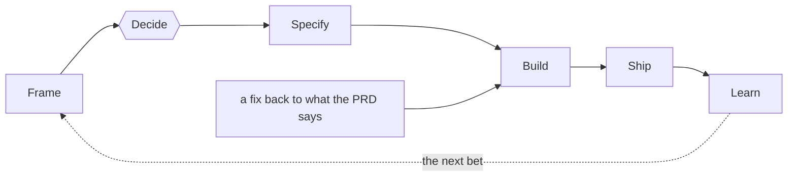

# The lifecycle

How work runs here, from the decision to build something to what using it taught. The decision to organise it this way, and what was rejected, is [ADR-0001](../adr/0001-adopt-a-lifecycle-from-bet-to-learning.md).

The unit is a **bet**: a piece of work expected to change something for the people who use the product, written down before it is built so that its use can say whether it did.

## Rules

No constraint here is optional. Breaking one does not slow the lifecycle down, it stops it being the lifecycle.

- **The hypothesis and the metric do not move after Decide.** A bet whose target changes once the evidence arrives cannot be lost, and teaches nothing.
- **Change the glossary deliberately, never as a side effect.** `product/domain.md` is read before a PRD is drafted. A change that needs the glossary altered says so and alters it as its own act.
- **Every change names the term it builds.** A change says which term of `product/domain.md` it makes real or extends, and why that term before any other still unbuilt. A change that can name none is not ready.
- **A PRD is edited before the code that changes it,** in its own pull request. Code that does something no PRD describes is a PRD edit that was skipped.
- **Never skip a decision a person owns, least of all under time pressure.** Whatever is not reserved for a person gets decided by whoever is executing.

## The steps

### Frame

A brief for the bet, drafted by an agent and owned by a person. It holds:

- **the problem**, as observed, with where it was seen;
- **the outcome** in `product/vision.md` it serves;
- **a hypothesis**: what doing this will change, for whom, and why;
- **a primary metric**: what would show the hypothesis held, and by when;
- **the stages** of [`product/journey.md`](../../product/journey.md) it covers;
- **what it leaves out.**

Every claim in it that nothing backs is labelled, as `AGENTS.md` says under *Claims*. A brief with gaps says so rather than filling them.

### Decide

A person decides whether to invest. Deciding fixes the hypothesis and the metric. Deciding not to is an outcome too, and the brief says why.

### Specify

The PRDs the bet creates or changes, drafted by an agent and approved by a person, each change its own pull request, merged before any code. [ADR-0002](../adr/0002-use-living-prds-as-the-product-contract.md) says why the PRD is the contract. The review is the moment the behaviour can still change cheaply: it fails while any decision is left for the agent to make alone.

### Build

The code the PRDs describe, one reviewed pull request at a time. A pull request does one thing; the review is of the code, not of a description of it.

**The review is a judgement, and says so.** Most of what it checks can be settled by looking: tests, build, static analysis. Whether the code is one to live with cannot: whether the design is right, whether the abstraction is the one to keep, whether something was rebuilt that already existed under another name. That rests on a person reading the diff. Where a repository has CI, a green pipeline is the review's entry condition and everything mechanical leaves the reviewer's attention; it never becomes sufficient, because an agent that writes both the code and its tests has checked its own work.

### Ship

A build a person uses. Only the person releasing starts it. What its use shows goes into one issue for that build, and the issue of the build before closes, as `AGENTS.md` says under *Feedback*.

### Learn

The evidence from use is read against the hypothesis, and the result is written down: whether it held, what the evidence was, and what it changes about the next bet. What the way of working itself taught, as opposed to the product, is written down too. The bet is then closed.

## Where the PRD is the authority, and where the code is

A PRD records what the product should do. The code records what it does. When they disagree, one of them is wrong, and having both is what makes the disagreement visible: a bug brings the code back to the PRD, and a decision to change the behaviour edits the PRD first.
