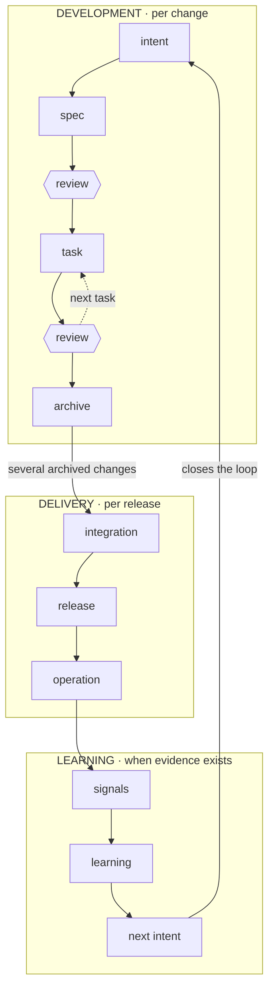
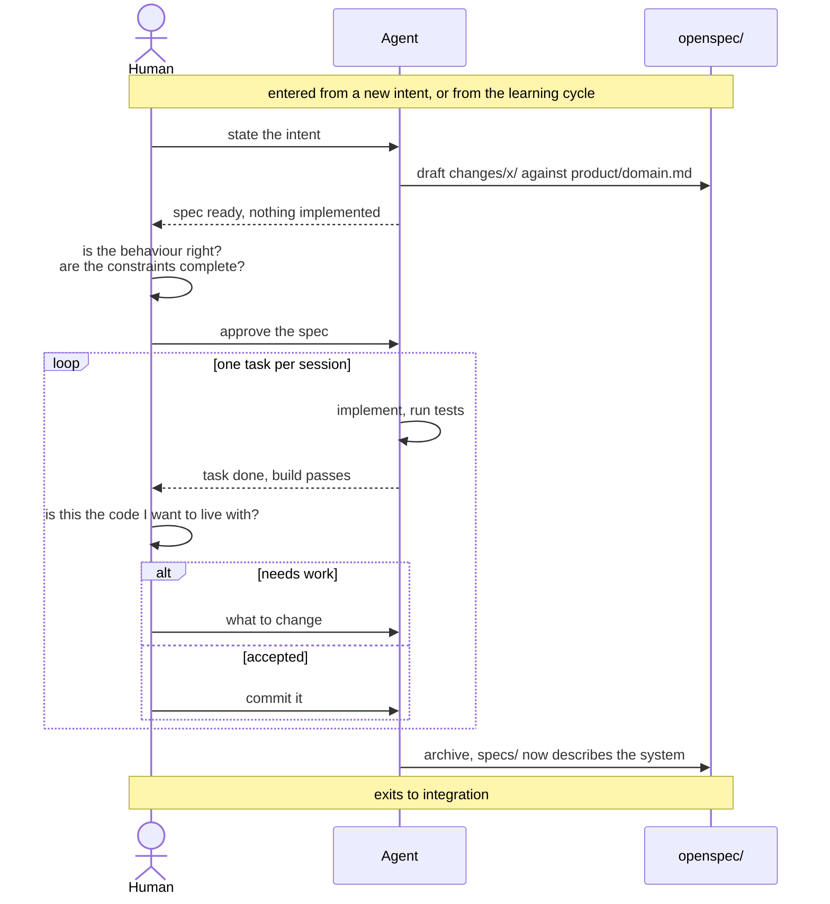

# The lifecycle

How work runs here. The decision to organise it this way, and what was rejected, is [ADR-0001](../adr/0001-adopt-an-agentic-development-lifecycle.md).

Three cycles, nested. Each turns at its own rate, and only the outer ones reach a person who is not working on the repository.

## Rules

No constraint here is optional. Breaking one does not slow the lifecycle down, it stops it being the lifecycle.

- **Change the glossary deliberately, never as a side effect.** `product/domain.md` is read before a spec is written. A change that needs the glossary altered says so and alters it as its own act.
- **Every change names the term it builds.** A change says which term of `product/domain.md` it makes real or extends, and why that term before any other still unbuilt. A change that can name none is not ready, whatever else it is.
- **Never skip a gate, least of all under time pressure.** Whatever is not reserved for a human gets decided by whoever is executing.
- **One task per session, reviewed and committed before the next.** Review is the constraint once authoring stops being one. Batching tasks makes the review too big to do properly.

The second rule exists because the first one is not enough on its own. Reading the glossary before writing a spec does not make a change build toward it, and a change can honour every word of the first rule while adding a screen the product never asked for. Naming the term is the part that can be checked from outside the change.

## Development

The only cycle specified. It turns once per change, several times a week.

### Step by step

Each row is a step in the diagram above, in order.

| Step | Who | What happens | Produces |
|---|---|---|---|
| `intent` | human | What should become possible, in a sentence or two. Not an implementation. | — |
| `spec` | agent | Drafts `openspec/changes/<name>/` from the intent, constrained by `product/domain.md`: behaviour, constraints, what is out of scope, and the tasks. | a draft spec |
| `review` | **human — gate 1** | Nothing is implemented yet, which is the point. The spec is edited until it is right. | an approved spec |
| `task` | agent | Implements one task and verifies it the way the spec named. | code and tests |
| `review` | **human — gate 2** | The code, not the description of it. Loops back to `task` until none remain. | a commit |
| `archive` | agent | Deltas merge into `openspec/specs/`; the change folder is archived. | updated `specs/` |

A spec is not a contract signed in advance. It stays editable once tasks begin, and a task that reveals the spec was wrong sends the change back to `spec` rather than working around it.

### Entry and exit criteria

A step starts when its entry criteria hold and finishes when its exit criteria do. Most are checkable by looking. One is not, and it is marked below.

| Step | Starts when | Finishes when |
|---|---|---|
| `intent` | someone can state what should become possible | the statement names a behaviour, not an implementation |
| `spec` | an intent exists and `product/domain.md` has been read | behaviour, constraints, out-of-scope and tasks are all written, and no task is larger than one session |
| `review` (1) | a draft spec exists | no decision is left for the agent to make alone, every constraint that matters is written down, and the change names the term it builds and why that one first |
| `task` | the spec is approved and the previous task is committed | the task's own verification passes |
| `review` (2) | one task is implemented and verified | **(judgement)** the code is one a reviewer will accept living with, and it is committed |
| `archive` | every task in the spec is committed | `openspec/specs/` describes the new behaviour and the change folder is gone |

The gate criteria are deliberately the hardest to satisfy. Gate 1 fails while anything is still implicit; gate 2 fails on code that works but should not be kept.

**Gate 2 is a judgement, and says so.** Every other criterion here can be settled by looking at the repository. "Code a reviewer will accept living with" cannot: it asks whether the design is right, whether the abstraction is the one to keep, whether something was rebuilt that already existed under another name. That rests on a person reading the diff.

It is meant to get narrower. Where a repository has CI, a green pipeline becomes gate 2's entry criterion, and everything mechanical — tests, build, static analysis, formatting — leaves the reviewer's attention and is settled before they look. Guards added over time do the same, each one converting a question that needed judgement into one that does not.

What is left for a person shrinks in proportion to how much the pipeline, the lifecycle and those guards have earned trust. It never reaches zero: an agent that writes both the implementation and its tests has verified its own work, so a green pipeline is a necessary condition and never a sufficient one.

### Where the code is the authority, and where it is not

`openspec/specs/` records intended behaviour. The code records actual behaviour. When they disagree, that is a bug, and having both is what makes the disagreement visible at all.

## Delivery

Turns once per release. **Named, not specified.**

Integration exercises the archived changes together, rather than each one alone. Release goes to staging and then to production. Operation is what is observed once it runs.

The steps stay undefined until there is a real release to describe. Writing the procedure before running it once would be inventing it.

## Learning

Turns when there is evidence to read. **Named, not specified.**

Signals come from operation, a learning is what they change about the model, and the next intent is what that produces.

This cycle cannot close without something running in production and someone using it. Until then its steps are a placeholder, and naming them serves one purpose: archiving a change is not shipping, and shipping is not learning.
